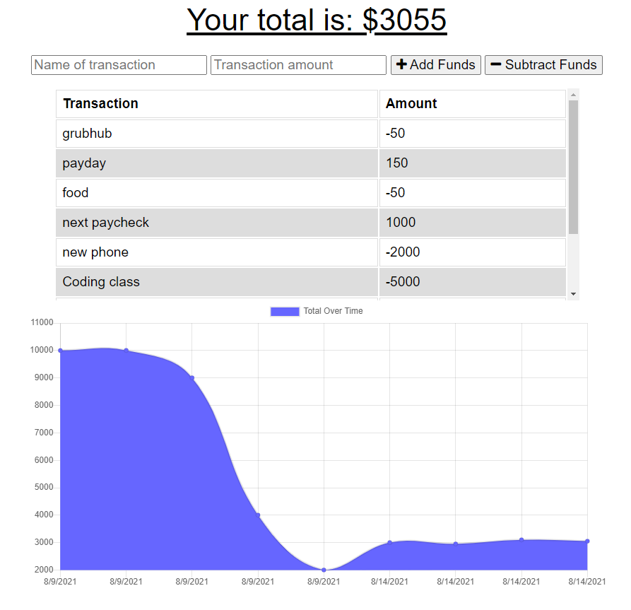

# budget-tracker-pwa

A PWA version of my Budget tracker

## Description

This budget tracker is a progressive web application that is designed to work both off and online. This means wherever you are in the world, you have access to this application so you can stay on top of your budget and available funds. The graph is made using chartJS to give the user a nice visual of their spending habits.

## Installation and Usage

In order to download this application on your you can either click the button in the right corner of your URL bar with a computer screen and a down arrow. If on Safari on an Iphone, you can save this app by clicking the share button in the middle bottom of your browser, this will give you a screen that allows you to "add to homepage". This will place an app bubble in the homescreen of your phone, from which you can access the budget tracker at all times.

Using the app is fairly simple. Add a name and amount for either a deposit or an expenditure, then click the button to either add or subtract funds.

## Credits

This web application was provided to me by the UCSD Extension Coding Bootcamp. I enabled all of the offline features and gave it the necessary components to become a Progressive Web Application.

